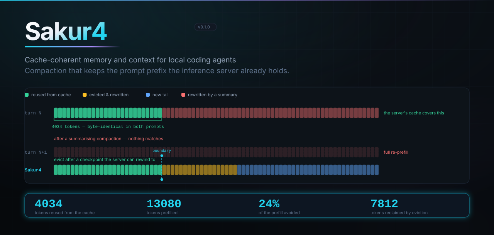
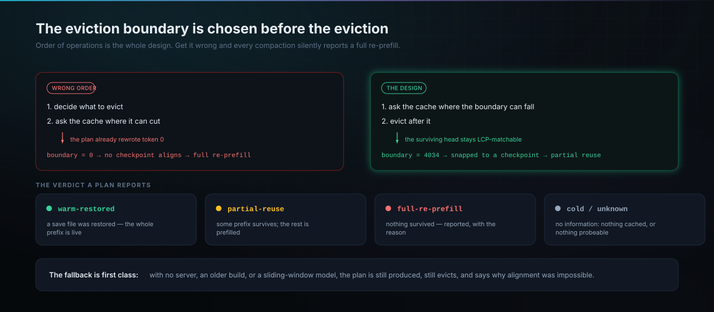
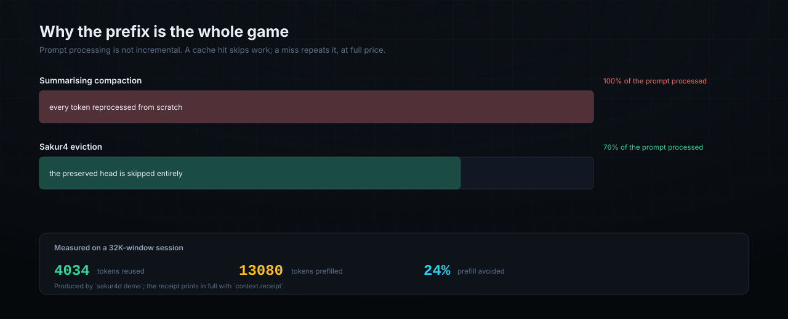
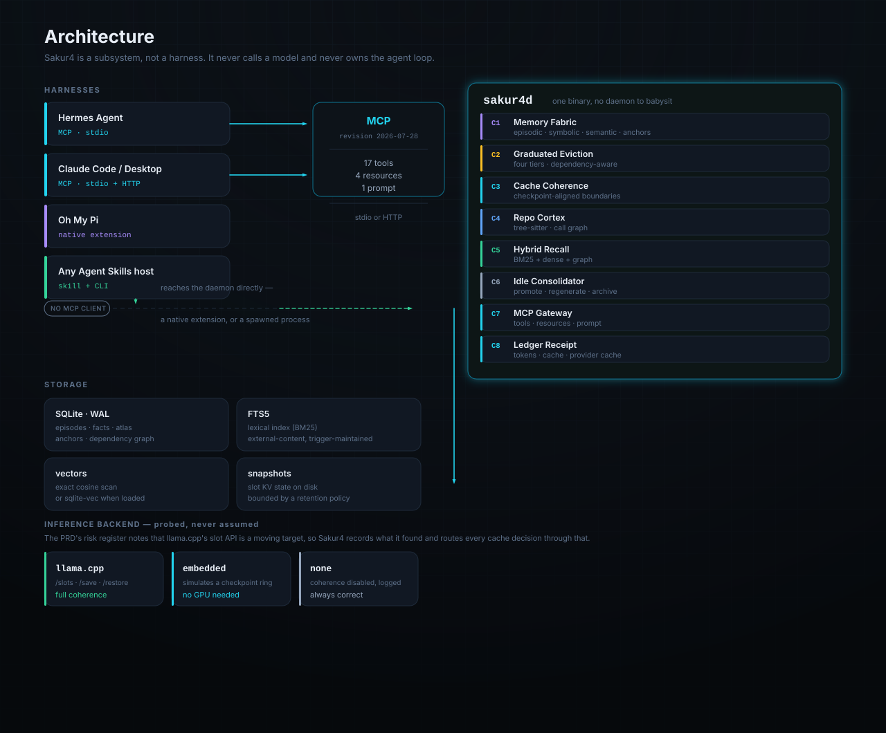
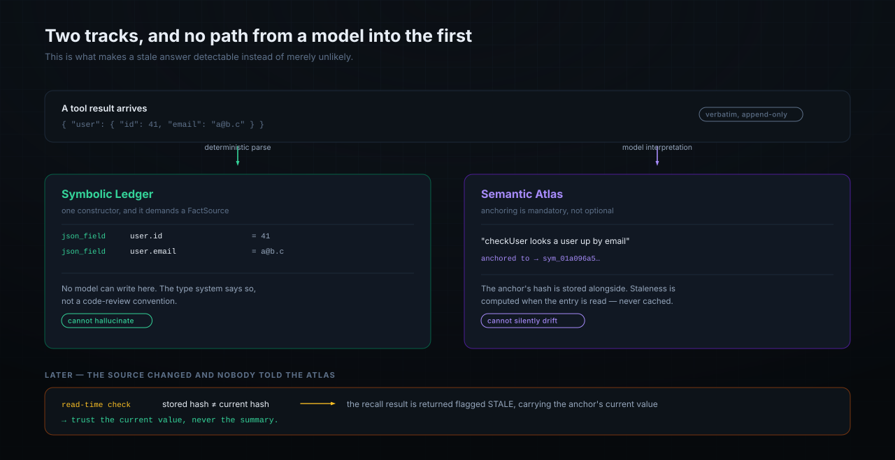
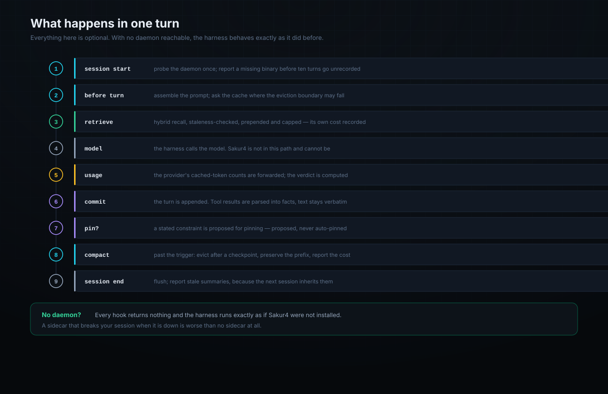
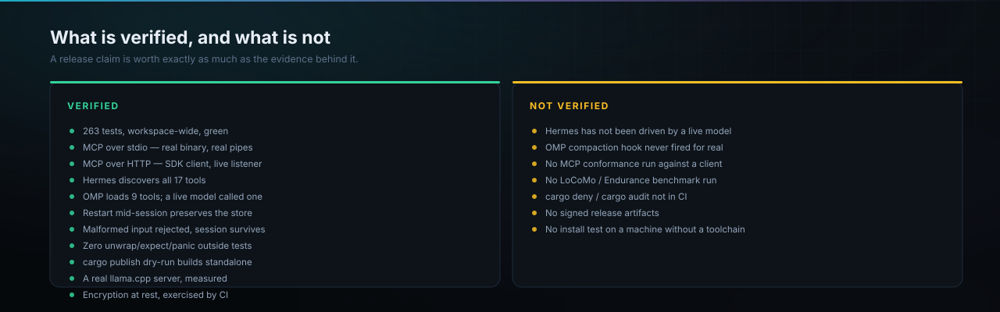
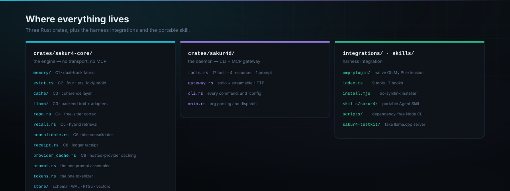

<div align="center">



<br>

### Your agent's compaction is the most expensive thing it does.

Sakur4 is a memory and context layer that makes it cheap instead.

Ships five ways in, so a harness needs no particular capability to be reached: an **MCP
server** for anything that speaks MCP, a **native Oh My Pi extension** for the harness that
does not, a **Hermes ContextEngine** that replaces its summariser rather than only exposing
tools, a **portable Agent Skill** for anything reading `~/.agents/skills/`, and an
**OpenAI-compatible reverse proxy** for a harness with none of those. One daemon behind all
five.

<br>

[](https://github.com/sc4rfurry/Sakur4/releases)
[](https://github.com/sc4rfurry/Sakur4/actions/workflows/ci.yml)
[](LICENSE)
[](https://github.com/sc4rfurry/Sakur4/stargazers)

[](#verification)
[](https://modelcontextprotocol.io)
[](https://www.rust-lang.org)
[](#install)
[](#design-decisions)

</div>

<br>

<table>
<tr>
<td width="50%" valign="top">

**What it is**

A memory and context layer that sits beside a coding agent. It keeps a verbatim record of
what happened, finds it again by meaning rather than by grepping, and — the part nothing else
does — **decides where to compact so the inference server's prompt cache still matches.**

</td>
<td width="50%" valign="top">

**What it is not**

Not a harness, not a model, not a proxy in the routing sense. It never calls a model and never
owns the agent loop. Every harness that uses it keeps owning its own session; Sakur4 advises
and records. Remove it and the agent still runs.

</td>
</tr>
</table>

<div align="center">

**Measured against a real 27B on a real server** — not a fixture

| tokens per turn | compactions | facts recalled | pinned constraint |
|:---:|:---:|:---:|:---:|
| **+1.3%** | 2 → **4** | 50% → **92%** | lost → **survived** |

<sub>205 turns, matched 81,920-token window, `window-first` profile. Full method and raw numbers in <a href="#benchmark-what-changes-with-it-and-without-it">the benchmark</a>.</sub>

</div>

---

## Contents

<table>
<tr><td valign="top" width="50%">

**Getting started**
- [The problem](#the-problem)
- [What Sakur4 does about it](#what-sakur4-does-about-it)
- [Install](#install)
- [Quick start](#quick-start)
- [Connect your harness](#connect-your-harness)
  - [MCP clients](#1--mcp--any-client)
  - [Oh My Pi](#2--oh-my-pi--native-extension)
  - [Hermes](#3--hermes--a-contextengine-not-just-tools)
  - [Agent Skills hosts](#4--agent-skill--no-mcp-no-extension)
  - [Anything else — reverse proxy](#5--anything-else--an-openai-compatible-reverse-proxy)

</td><td valign="top" width="50%">

**Reference**
- [How it works](#how-it-works)
- [The tool surface](#the-tool-surface)
- [Configuration](#configuration)
- [CLI reference](#cli-reference)
- [Troubleshooting](#troubleshooting)
- [Benchmark: with vs without](#benchmark-what-changes-with-it-and-without-it)
- [Verification](#verification)
- [Design decisions](#design-decisions)
- [How this compares](#how-this-compares)
- [Limitations](#limitations)

</td></tr>
</table>

---

## The problem

An agent harness compacts when the context window fills. It replaces the transcript
with a summary and sends the result.

That new token sequence shares **no prefix** with the old one. llama.cpp's
longest-common-prefix slot matching therefore finds nothing, and the entire compacted
context is re-prefilled — 100+ seconds for a 50K-token session on consumer hardware.

The operation whose purpose was to make the session cheap becomes the most expensive
thing in it. Nothing in that loop is wrong: the harness and the inference server simply
do not know about each other.

It gets worse on a hosted provider. There, the prompt cache is billed, so a rewrite does
not just cost latency — it costs money for tokens that had already been paid for.
Hermes' own documentation calls this "the strongest argument against" per-turn
compaction, and notes the trade depends on numbers specific to the user.

**Sakur4 knows about both sides, so it can supply those numbers and act on them.**

---

## What Sakur4 does about it



The order of operations **is** the design:

1. Ask the inference server where its KV cache can be rewound to.
2. Choose the eviction boundary from those checkpoints.
3. Evict *after* it.

Doing it the other way round — deciding what to evict, then asking the cache — produces
a boundary at token 0, which no checkpoint can align to. Every compaction then reports a
full re-prefill: the exact failure the project exists to remove, arrived at by its own
machinery.

Three versions of that logic were written before one was right, and **each wrong version
left the entire test suite green.** That is why the claim is stated as executable
contracts in [`cache_coherence.rs`](crates/sakur4-core/tests/cache_coherence.rs) rather
than as a promise in a README.



---

## Install

**Requirements:** Rust 1.94+ to build from source. No GPU, no model, no network — the
embedded backend simulates a llama.cpp checkpoint ring in-process, so everything works
anywhere.

<table>
<tr><th>Method</th><th>Command</th><th>Notes</th></tr>
<tr><td><b>Install script</b></td><td><code>curl -fsSL https://raw.githubusercontent.com/sc4rfurry/Sakur4/main/install.sh | sh</code></td><td>Detects your platform, <b>verifies the checksum</b>, installs, and says where the skill went.</td></tr>
<tr><td><b>Release binary</b></td><td>Download from <a href="https://github.com/sc4rfurry/Sakur4/releases">Releases</a></td><td>Archives carry <code>sakur4d</code>, the skill and the OMP plugin together.</td></tr>
<tr><td><b>From a checkout</b></td><td><code>cargo install --path crates/sakur4d</code></td><td>Builds and installs in one step. About eight minutes from cold; verified.</td></tr>
<tr><td><b>From source</b></td><td><code>cargo build --release</code></td><td>Then copy <code>target/release/sakur4d</code> onto your <code>PATH</code>.</td></tr>
</table>

The installer **refuses to install an archive it cannot verify**. If `SHA256SUMS.txt` is
unreachable, or does not list your platform's archive, it stops rather than continuing — an
installer that silently skips verification teaches people to trust the output of a pipe.

`SAKUR4_VERSION=v0.1.0` pins a release; `SAKUR4_BIN_DIR` chooses where it lands.

**Publishing to crates.io, if you want `cargo install sakur4d` to work:** publish
`cargo publish -p sakur4-core` **first**. `cargo publish` resolves a path dependency through the
registry, so the binary crate cannot be published until the core crate is on crates.io —
publishing in the other order fails with `no matching package named 'sakur4-core' found`. The
full sequence, and what is deliberately not automated, is in [docs/RELEASING.md](docs/RELEASING.md).

Put the binary somewhere on `PATH` — `~/.cargo/bin` is where `cargo install` puts it and
where every integration looks first. If it lives somewhere unusual, set `SAKUR4_BIN` and
everything will find it.

---

## Quick start

```bash
# A guided walkthrough: dual-track write, staleness detection, a real compaction,
# the cache verdict, round-trip integrity. Needs nothing but the binary.
sakur4d demo --db :memory:
```

<details>
<summary><b>See what it prints</b> — real output, not an illustration</summary>

```text
=== 2 · the dual-track discipline ===
  committed user turn · 38 tokens · symbolic: not a tool result
  constraint detector proposed a pin (rule explicit_never, confidence 0.70):
    Important rule for this repository: never force-push to main...
  pinned anc_01a096a5... as safety_constraint — now exempt from every eviction tier
  committed tool result · 28 tokens · symbolic: 3 JSON field paths
  committed unstructured result · symbolic: no structure detected; retained as raw episodic text only

=== 3 · staleness: an interpretation that outlived its source ===
  wrote interpretation atlas_01a096a5... (anchored, not stale yet)
  ...the function is then edited (signature and body both change)

  === RECALLED MEMORY ===
  [1] (symbolic_fact · score 0.760)
      src::auth::checkUser — fn checkUser(id: UserId) -> Result<User>
  [2] (semantic_entry · score 0.175 · STALE)
      [STALE SUMMARY — do not trust] checkUser looks a user up by their email address
        ↳ the anchor it was derived from has changed since this summary was written;
          re-read the source or call code.query_symbol to get the current truth.
        ↳ CURRENT VALUE: src::auth::checkUser — fn checkUser(id: UserId) -> Result<User>
  → 1 hit(s) flagged stale, each carrying its anchor's current value

=== 5 · the eviction decision ===
  pressure       Compacting
  budget         32768 · trigger 24576 · target 18022
  live 24847 · anchors 69 · fixed 73
  6 episode(s), 7812 tokens reclaimed (24989 → 17177 of 18022 target).
    partial reuse — prefix survived compaction
  anchor safety: 1 anchor(s) pinned, 0 of them in the eviction set (must be 0)

=== 6 · applying it, and what the cache did ===
  cache: partial reuse — prefix survived compaction
  Context Ledger Receipt · turn 1 · session demo
    window 17114/32768 tokens (52% full) · tokenizer backend-exact · backend embedded
    where the budget went:
      raw recent history     17041   99.6%  ██████████████████
      pinned anchors            51    0.3%  ··················
      system prompt             22    0.1%  ··················
    cache: partial-reuse
      slot retained 4034 tokens at checkpoint 4034 (hash 5acbd3726c22e18e);
      4034 tokens reused from the LCP, 13080 prefilled
      4034 tokens reused / 13080 prefilled (24% saved)

=== 7 · round-trip integrity (FR-5) ===
  recalled 3 evicted episode(s) verbatim — content is unchanged by eviction
```

</details>

That receipt is the same one `context.receipt` returns over MCP, and that plan is the
same one `context.plan_eviction` returns. **Nothing in the demo is a special path.**

Then, against a real repository:

```bash
sakur4d index .                  # build the code graph (incremental; cheap to re-run)
sakur4d repo-map --budget 1500   # structural outline fitted to a token budget
sakur4d impact src::auth::validate   # every call site that depends on it
sakur4d doctor                   # what backend and cache capabilities were detected
```

---

## Connect your harness

Three routes, because harnesses disagree about what they support. All reach the same
daemon and the same memory, and you can use more than one.



### 1 · MCP — any client

```bash
sakur4d config hermes          # ~/.hermes/config.yaml
sakur4d config claude          # claude_desktop_config.json
sakur4d config claude-code     # one-line CLI registration
sakur4d config generic-http    # anything that connects to a URL
sakur4d config generic-stdio   # anything that spawns a child process
```

`config` prints ready-to-paste configuration with **this binary's absolute path and
store baked in**, so there is no placeholder to forget.

```bash
sakur4d serve                              # stdio — the default
sakur4d serve --transport http --bind 127.0.0.1:8765   # shared
```

| Transport | How the harness reaches it | Use it when |
|---|---|---|
| **stdio** | spawns `sakur4d` and speaks JSON-RPC over its pipes | one harness; no port to manage. This is every MCP client. |
| **streamable HTTP** | connects to a URL | several sessions sharing one store, or a harness on another machine |

Verified against a real Hermes install:

```console
$ hermes mcp test sakur4
  Testing 'sakur4'...
  Transport: stdio → D:\DuDu\Sakur4\target\debug\sakur4d.exe
  ✓ Connected (5765ms)
  ✓ Tools discovered: 17
```

### 2 · Oh My Pi — native extension

For OMP there is **no MCP client**. It needs a native TypeScript extension instead — which
turns out to be an advantage, because an extension can see inside the agent loop and
therefore reach hooks a tool provider cannot.

```bash
node integrations/omp-plugin/install.mjs
```

Then restart OMP and ask it to list its `sakur4_` tools — there should be nine.

### 3 · Hermes — a ContextEngine, not just tools

Hermes has its own compaction path, so exposing MCP tools is not enough: its summariser
still runs. `integrations/hermes-plugin/` replaces it, which also closes a loop MCP alone
cannot — `update_from_response` receives the provider's token accounting on every call, so
prompt-cache behaviour is measured automatically instead of reported by hand.

```bash
cp -r integrations/hermes-plugin "$LOCALAPPDATA/hermes/plugins/sakur4"
# then set `context.engine: sakur4` in ~/.hermes/config.yaml
```

Verified by 44 contracts against a live daemon. See
[integrations/hermes-plugin](integrations/hermes-plugin/README.md).

### 4 · Agent Skill — no MCP, no extension

`skills/sakur4/` is a portable [Agent Skills](https://agentskills.io/specification)
package: a `SKILL.md` plus a **dependency-free** Node CLI over the daemon.

```bash
node integrations/omp-plugin/install.mjs --skill-only   # → ~/.agents/skills/
```

`~/.agents/skills/` is the standard location, so OMP, Claude Code, Codex and pi all pick
it up with no further configuration. Progressive disclosure means only the description
sits in context until a task matches.

The CLI locates `sakur4d` across install layouts, defaults the store to
`~/.sakur4/sakur4.db`, and spawns with `shell: false` — so recorded content may contain
quotes, newlines or backticks intact. That matters when the primary use is committing the
user's words verbatim.

### 5 · Anything else — an OpenAI-compatible reverse proxy

A harness with none of the above still works. Point it at the proxy instead of at
`llama-server` and nothing else changes:

```bash
sakur4d proxy --bind 127.0.0.1:8090 --upstream http://127.0.0.1:8080
# harness base URL: http://127.0.0.1:8090/v1
```

Requests are forwarded untouched — every unrecognised route included, so a harness calling
an endpoint this build has never heard of gets the upstream's own answer rather than a 404
from Sakur4. A transcript that exceeds the window is trimmed on the way through, with a
marker left in place of the removed turns, and the provider's token accounting is recorded
from the response the proxy already had to read.

`--observe-only` forwards everything unchanged and only records, which is the safe way to
see what it *would* have done on your real traffic before letting it act.

> **Do not run the proxy and the OMP extension at the same time.** Both manage context, and a
> turn gets managed twice — OMP hangs before sending its first request. Use the proxy *or* the
> extension. `--no-extensions` disables the extension for a proxied session. Verified, and the
> full comparison is in [docs/verification/proxy-harness.md](docs/verification/proxy-harness.md).

| Hook | What Sakur4 does with it |
|---|---|
| `session_start` | probes the daemon once; reports a missing binary before ten turns go unrecorded; live counts in the status bar |
| `before_agent_start` | injects the working preamble **once** per session — the instructions that make a model actually pin and fold |
| `context` | retrieves memory for the prompt, capped, and **reports its own token cost** so the budget stays honest |
| `message_end` | forwards provider token usage every turn, automatically — this is what makes cloud cache accounting work without being asked |
| `session_before_compact` | replaces blind summarisation with Sakur4's planned eviction |
| `session_shutdown` | reports stale summaries, because the next session inherits them |
| `resources_discover` | contributes the bundled Agent Skill |

<details>
<summary><b>Two install traps this avoids</b></summary>

**`omp install` symlinks**, which fails on Windows with a bare
`EPERM: operation not permitted, symlink` unless Developer Mode is on. The installer
copies instead.

**OMP's plugin loader silently skips a lockfile entry** that is neither declared in
`~/.omp/plugins/package.json` **nor** a symlink — reporting it only as
`skipping stale lockfile entry` in a log. The plugin then appears in `omp plugin list`
*and* passes `omp plugin doctor`, while never actually loading. Writing both files is the
fix, and it is the difference between a plugin that looks installed and one that works.

</details>

---

## How it works

### Memory is two tracks, and no model can write to the first



Most memory systems store what a model *said about* the code. That is fine until the code
changes, at which point the stored interpretation is confidently wrong and nothing
detects it.

Sakur4 splits the two. Deterministic parsers write facts. Models write interpretations,
and every interpretation must name the fact it was derived from. When a recall hits an
interpretation whose anchor's hash has changed, it comes back flagged `STALE` **carrying
the anchor's current value** — so the agent has something true to act on rather than
something plausible to believe.

### The guarantees are structural, not aspirational

| Guarantee | Enforced by |
|---|---|
| A model cannot write the Symbolic Ledger | `SymbolicFact` has exactly one constructor, and it demands a `FactSource`. The module imports nothing that could reach an inference client. |
| Recorded content cannot be altered | `UPDATE` and `DELETE` on episode content are blocked by database triggers — so "an evicted episode recalls byte-identically" holds for code not yet written. |
| Anchors cannot be evicted | Eviction selects from episodes; anchors live in a different table. The operation is not expressible. |
| Budget decisions and printed numbers agree | One `TokenCounter`, one `PromptParts`. Estimating in one place and measuring in another has already caused a real bug here. |
| Library code does not panic | Zero `unwrap`/`expect`/`panic!` paths outside tests. Malformed harness input is a typed error. |

### Four tiers, applied one step at a time

`masked` → `referenced` → `archived` → `dropped`

A tier is never skipped. Selection is deterministic — token counts, recency, graph
in-degree, explicit droppability — so a plan is reproducible, auditable, and cannot
hallucinate. No model is in the decision path.

`memory.fold` / `memory.unfold` let the agent isolate a subtask deliberately: a
checkpoint is taken at fold open, the intermediate steps leave the window at fold close,
and the full trace stays retrievable with `memory.recall_fold`.

### Every plan ends in one of four reported verdicts

`aligned` · `snapped` · `partial-reuse` · `full-re-prefill`

**The fallback is first class.** With no server, an older build without `/slots`, or a
sliding-window model whose checkpoints carry only partial state, the plan is still
produced, still evicts, and says why alignment was impossible. Sakur4 is always correct;
it is only sometimes not optimally fast.

### A turn, end to end



### Cache accounting, local and cloud

A local llama.cpp slot reports its cache state through its own API. A hosted provider has
no such API — but it does report, in every response, how many prompt tokens came from its
prompt cache.

```jsonc
// The harness reports what the provider said.
context.record_usage { "session_id": "s", "prompt_tokens": 6200,
                       "cache_read_tokens": 300 }

// Sakur4 answers with a verdict.
{ "verdict": "PREFIX-BROKEN", "regression": true,
  "detail": "the provider's cached prefix fell from 5000 to 300 tokens (4700 tokens
             no longer cached) while the prompt went 6000 → 6200; this turn was
             billed for history that had already been paid for" }
```

The signature is an inversion: append-only growth makes the cached prefix *grow*, while a
rewrite that replaces a long prefix with a shorter one makes it *shrink* even as the
prompt stays large. That inversion is detectable, and `context.receipt` reports it per
session.

**Sakur4 never calls a provider itself.** It is a subsystem, not a harness — the same
reason it does not call the model. The harness pushes the numbers; Sakur4 does the
accounting and the eviction.

---

## The tool surface

**17 tools**, **4 resources**, **1 prompt**, targeting MCP revision **2026-07-28** with
`ttlMs` and `cacheScope` on list responses.

<details open>
<summary><b>Memory</b></summary>

| Tool | Required | Optional |
|---|---|---|
| `memory.commit_episode` | `role`, `content` | `tool_name`, `session_id`, `slot_id` |
| `memory.pin` | `content` | `kind`, `session_id` |
| `memory.recall` | `query` | `k`, `session_id`, `file_path`, `include_folded` |
| `memory.fold` | `description`, `goal` | `session_id`, `slot_id` |
| `memory.unfold` | `fold_id`, `result_summary` | `session_id`, `slot_id` |
| `memory.recall_fold` | `fold_id` | — |
| `memory.staleness` | — | `limit`, `project_id` |
| `sakur4.dream` | — | `force` |

Pass `tool_name` on a tool result: the symbolic extractor uses it to pick a parser, so a
diff, a JSON body or an exit status becomes deterministic facts rather than prose.

</details>

<details>
<summary><b>Code intelligence</b></summary>

| Tool | Required | Optional |
|---|---|---|
| `code.get_repo_map` | `token_budget` | `focus_paths` |
| `code.query_symbol` | `qualified_name` | — |
| `code.impact_of_change` | `qualified_name` | `depth` |

`query_symbol` reads the parser-derived index, so it **cannot be stale** — it is the
right way to check something you only remember from a summary.

</details>

<details>
<summary><b>Context and session</b></summary>

| Tool | Required | Optional |
|---|---|---|
| `context.receipt` | — | `session_id`, `assemble` |
| `context.plan_eviction` | `session_id` | `slot_id`, `apply`, `pending_recall` |
| `context.record_usage` | `prompt_tokens` | `completion_tokens`, `total_tokens`, `cache_read_tokens`, `cache_write_tokens`, `reasoning_tokens`, `provider`, `model`, `session_id`, `slot_id` |
| `session.snapshot` | — | `session_id`, `slot_id` |
| `session.restore` | `path` | `session_id`, `slot_id` |
| `sakur4.status` | — | — |

`plan_eviction` plans by default. Nothing changes until you pass `apply: true`.

</details>

<details>
<summary><b>Resources and prompt</b></summary>

**Resources**

| URI | Contents |
|---|---|
| `sakur4://repo-map/{project}` | The structural outline |
| `sakur4://receipt/latest` | The most recent Context Ledger Receipt |
| `sakur4://anchors/{project}` | Every pinned constraint |
| `sakur4://status/{project}` | Backend, capabilities and store counts |

**Prompt** — `sakur4_system_preamble`, which names *when* to call each tool rather than
what it does. The failure mode with smaller instruction-tuned models is
under-triggering: they have the tools and do not reach for them. Numbered triggers fixed
that in testing; a prose description did not.

</details>

### Reporting provider usage

Field names differ by provider. Normalise whichever you have:

| Provider | Field to read |
|---|---|
| OpenAI | `prompt_tokens_details.cached_tokens` |
| Anthropic | `cache_read_input_tokens` / `cache_creation_input_tokens` |
| DeepSeek | `prompt_cache_hit_tokens` |
| Gemini | `cachedContentTokenCount` |
| Groq, others | often absent — **omit the flag rather than sending zero** |

Omitting is not the same as zero. Zero asserts a cache miss; omitting says the provider
did not report one, and Sakur4 says so rather than blaming a cache it cannot see.

---

## Configuration

Everything is optional. The defaults work.

| Variable | Default | Meaning |
|---|---|---|
| `SAKUR4_BIN` | searched | Path to `sakur4d` |
| `SAKUR4_DB` | `sakur4.db` (daemon) · `~/.sakur4/sakur4.db` (skill) | Memory store |
| `SAKUR4_SESSION` | derived | Session id |
| `SAKUR4_BACKEND` | `auto` | `auto` · `embedded` · `none` · a llama.cpp base URL |
| `SAKUR4_EMBED_API_KEY` | unset | Key for a configured embedding endpoint |

**Oh My Pi extension extras**

| Variable | Default | Meaning |
|---|---|---|
| `SAKUR4_RETRIEVE` | `true` | Inject retrieved memory before each turn |
| `SAKUR4_REPORT_USAGE` | `true` | Report provider usage automatically |
| `SAKUR4_OWN_COMPACTION` | `true` | Take over compaction |
| `SAKUR4_RECALL_BUDGET` | `1200` | Approximate token cap on injected memory |
| `SAKUR4_PLUGIN_LOG` | unset | Append lifecycle diagnostics to this file |

### The three backends

| Backend | What it is | Cache coherence |
|---|---|---|
| `llama.cpp` | A real server. Probes `/slots`, `/props`, `/tokenize`, `/metrics`. | Full |
| `embedded` | Simulates a checkpoint ring in-process. Default when nothing is listening. | Full, simulated |
| `none` | Coherence disabled; degradation logged. | Reported as `full-re-prefill` |

```bash
llama-server -m model.gguf -c 65536 --slots -cms 256 -ctxcp 64
sakur4d --backend http://127.0.0.1:8080 doctor
```

`doctor` prints exactly which endpoints were detected and what that means for compaction.
`--backend` accepts a URL on another machine.

---

## CLI reference

<details open>
<summary><b>Commands</b></summary>

```text
serve                     Run the MCP gateway (stdio or HTTP; --banner for stderr diagnostics)
proxy                     Run the OpenAI-compatible reverse proxy (FR-18)
                          --upstream <url>  --bind <addr>  --observe-only
config <harness>          Print ready-to-paste integration config
doctor                    What backend and cache capabilities were detected
demo                      Guided end-to-end walkthrough

index <path>              Build or incrementally refresh the Repo Cortex index
repo-map [--budget N]     Token-budgeted structural outline
symbol <qualified>        A symbol's current signature
impact <qualified>        Transitive blast radius

commit <session> <text>   Append a turn (--role, --tool, --slot)
pin <text> --kind <k>     Pin a constraint
anchors [--session S]     List pinned constraints
recall <query> [--k N]    Hybrid search
plan <session>            Show an eviction decision without applying it
receipt <session>         Token accounting and cache verdict
snapshot / restore        Persist or reload slot KV state
dream                     One memory-maintenance pass
staleness                 Summaries that no longer match their source
```

`fold`, `unfold` and `recall_fold` exist as MCP tools only — they are called by an agent
mid-task, not by a person at a shell, and the skill's CLI exposes them through the
protocol for that reason.

</details>

---

## Troubleshooting

<details>
<summary><b>"Sakur4: no sakur4d binary found"</b></summary>

The extension searched and did not find it. Check where yours actually is:

```bash
which sakur4d        # or: where.exe sakur4d on Windows
```

If that prints nothing, the binary is not on `PATH`. Either move it onto `PATH` — the
most likely place is `~/.cargo/bin` — or point at it directly:

```bash
export SAKUR4_BIN=/full/path/to/sakur4d      # $env:SAKUR4_BIN on Windows
```

The warning lists every path that was searched, so you can see whether your install
landed somewhere unexpected.

</details>

<details>
<summary><b>The OMP plugin is installed but its tools are missing</b></summary>

Set the diagnostic log and restart OMP:

```bash
SAKUR4_PLUGIN_LOG=/tmp/sakur4.log omp
cat /tmp/sakur4.log
```

If there is no log at all, the extension never loaded — check that `omp-sakur4` is in
`~/.omp/plugins/package.json` **dependencies**, not only in the lockfile. If the log shows
`daemon: null`, see the entry above.

A plugin that silently does nothing and a plugin that failed to load are otherwise
indistinguishable, because OMP surfaces extension-load errors only to a TTY.

</details>

<details>
<summary><b>A turn was slow, or cost more than expected</b></summary>

```bash
sakur4d receipt <session>
```

This prints where the token budget went and the cache verdict. If it says
`full-re-prefill`, the plan could not align to a checkpoint — the reason is printed with
it. If it says `PREFIX-BROKEN`, a rewrite invalidated the provider's cache and you were
billed for it.

Also worth checking: `sakur4d doctor` reports which cache endpoints were detected. A
backend resolved as `embedded` explains a simulated verdict.

</details>

<details>
<summary><b>Recall returns a STALE result</b></summary>

That is the system working. A stale summary is one whose anchor has changed since it was
written. It comes with the anchor's **current value** attached — use that, not the
summary above it.

To regenerate them: `sakur4d dream`, or `memory.staleness` to see the full list first.

</details>

<details>
<summary><b>Everything is slow and the store is huge</b></summary>

Check what is in it and how stale it is:

```bash
sakur4d doctor          # store counts, backend, capabilities
sakur4d staleness       # summaries that no longer match their source
```

Cold archival runs during `dream`. Snapshots are pruned by count under
`SAKUR4_SNAPSHOT_DIR`.

</details>

---

## Benchmark: what changes with it, and without it

The honest answer, measured over 205 turns against a real repository — the same session
run twice, once the way a harness does today and once through Sakur4:

Measured against a real llama.cpp server (a 27B model, 81,920-token window):

| | without | with Sakur4 | change |
|---|---|---|---|
| tokens per turn | 31,580 | 31,980 | **+1.3%** |
| prefix kept reusable | 0 | 47,425 | — |
| **recall accuracy** | **50%** | **92%** | **+42 pts** |
| **pinned constraint survived** | **lost at compaction 2** | **survived** | — |

**+1.3% more tokens, for 42 points of recall and a constraint that no longer gets
destroyed.** At that magnitude it is not a trade at all.

The engine picks its eviction tuning from what the backend can do: `cache-first` when a
checkpoint ring exists and a preserved prefix is genuinely reusable, `window-first` when
there is no checkpoint to align to and window room is the scarcer resource. Your server
selects `window-first` automatically — `doctor` reports which is active and why.

```bash
node docs/bench/ab.mjs --repo .                              # embedded backend
node docs/bench/ab.mjs --repo . --backend http://host:8080   # real prefill numbers
```

A **live-model** companion — whether a real model actually benefits, rather than whether
the engine works — is in [docs/bench/live-model.md](docs/bench/live-model.md). Controlled
A/B/C against a locally served 27B model through OMP: plugin-on answered a question only memory
could answer; plugin-off with the *same store* said UNKNOWN; plugin-on with an empty store
said UNKNOWN.

Full method — including three bugs the benchmark itself had, recorded rather than
quietly fixed — is in [docs/bench](docs/bench/README.md).

---

## Verification



A release claim is worth exactly as much as the evidence behind it.

**The tests are not all unit tests.** `stdio_transport.rs` spawns the real binary and
speaks JSON-RPC over its pipes. `gateway.rs` drives the tool surface over a live HTTP
listener using the SDK's own client. `cache_coherence.rs` states the central claim as
contracts and fails if the preserved prefix stops being a byte prefix of what the server
is actually sent.

That suite found two bugs no amount of self-testing would have:

1. A single tool whose `outputSchema` had no `type` — because it returned a bare
   `serde_json::Value` — made Hermes reject the **entire 17-tool catalog** and refuse to
   connect.
2. A `WARN`-level log line written to **stdout** corrupted the JSON-RPC channel over
   stdio. A client that reads stdout as frames cannot recover from that.

One command runs everything, and reports **skipped separately from passed** — a run that
skipped its live-server checks is not a green run:

```bash
node verify.mjs                              # everything this machine can run
node verify.mjs --upstream http://host:8080  # add the live llama.cpp checks
node verify.mjs --quick                      # skip the slow benchmarks
node verify.mjs --only rust,hermes           # a subset, by group or check id
node verify.mjs --list                       # what exists, and what each group needs
```

A full local run against a real llama.cpp: **12 passed, 0 failed, 1 skipped**, where the
skip names its reason rather than hiding — SQLCipher needs OpenSSL development files this
machine does not have.

| Group | Needs | CI |
|---|---|---|
| `rust` | nothing | Linux, macOS, Windows |
| `encryption` | OpenSSL development files | Linux only — see `crates/sakur4-core/Cargo.toml` |
| `hermes` | python + a built daemon | Linux, with a stubbed Hermes |
| `bench` | a repository to index | partly |
| `live` | `--upstream` | **no — no server in CI** |
| `harness` | OMP or the Hermes CLI | **no — not installed in CI** |

Underneath, CI also runs a release-profile build (LTO and `codegen-units = 1`, so a
release-only link error cannot hide), an MSRV build at the declared 1.94, and a
`cargo publish` dry run that builds the extracted archive in isolation.

---

## Design decisions

<details>
<summary><b>Why one binary instead of a service</b></summary>

A memory layer that needs a daemon lifecycle, a port, a supervisor and a reconnect path
is a memory layer that gets uninstalled. `sakur4d` is one binary: stdio mode spawns it as
a child, HTTP mode runs it in the foreground. There is nothing to keep alive.

</details>

<details>
<summary><b>Why the plugin has no runtime dependencies</b></summary>

`typebox` and `pi-ai` live nested inside OMP's own tree, not somewhere a separately
installed package can resolve them. Tool schemas are therefore written as plain JSON
Schema objects — which is the shape the host serialises anyway. A plugin that fails to
load because of a schema library is a plugin nobody can use.

</details>

<details>
<summary><b>Why extraction is extractive by default</b></summary>

Promotion summarises a turn into something searchable. Doing that with a model would
mean Sakur4 needs a model resident to maintain memory — and would put a model in the path
of something that is supposed to be deterministic. The default is extractive and
anchored; an optional auxiliary endpoint switches to genuine interpretation, still
anchored. A promotion that produces a *longer* summary than the turn it replaces is
skipped and reported.

</details>

<details>
<summary><b>Why staleness is computed at read time</b></summary>

A boolean `stale` column needs a job to keep it current, and a job that has not run is a
lie the system tells itself. Sakur4 compares the anchor's stored hash against its current
one when the entry is read. There is no window in which a stale interpretation looks
fresh.

</details>

<details>
<summary><b>Why the figures are generated</b></summary>

[`docs/assets/generate.mjs`](docs/assets/generate.mjs) defines the palette, type scale and
primitives once, and each figure is a function over them. More importantly the numbers in
them come from `sakur4d demo`, so when the engine changes they are regenerated rather
than left to drift into a picture nobody re-reads.

</details>

---

## How this compares

Most agent-memory projects answer *"how do we remember more?"* Sakur4 answers *"how do we
forget well?"* — because the constraint is not storage, it is the context window and what
refilling it costs.

| | Sakur4 | MemGPT / Letta | Mem0 | Plain RAG | Harness compaction |
|---|---|---|---|---|---|
| Persistent memory | ✅ | ✅ | ✅ | ✅ | ❌ |
| Staleness detection | ✅ read-time, anchored | ❌ | ❌ | ❌ | n/a |
| Deterministic facts | ✅ no model in path | ❌ | ❌ | ❌ | ❌ |
| **Knows the KV cache exists** | ✅ | ❌ | ❌ | ❌ | ❌ |
| **Aligns eviction to checkpoints** | ✅ | ❌ | ❌ | ❌ | ❌ |
| Cloud prompt-cache accounting | ✅ | ❌ | ❌ | ❌ | ❌ |
| Verbatim recall after eviction | ✅ by construction | partial | ❌ | ✅ | ❌ |
| Code-graph awareness | ✅ tree-sitter | ❌ | ❌ | partial | ❌ |
| Runs with no model resident | ✅ | ❌ | ❌ | ✅ | ✅ |
| Deployment | one binary, MCP | service | service | varies | built in |

The comparison is not that the others are worse — they solve different problems, and
several are more mature. It is that **none of them are aware of the thing that makes
compaction expensive.**

---

## Limitations

Stated plainly, because the alternative is finding out later.

**Not yet true**

- ~~**No real llama.cpp server has been contacted.**~~ **Now verified** against a
  a live locally served 27B model — see
  [docs/verification](docs/verification/README.md). That build exposes **no checkpoint
  API** (save/erase return 501, no checkpoint ring), so Sakur4 correctly reports
  `no checkpoint source detected`. Prefix reuse nonetheless works there: a 2,219-token
  preserved prefix followed by new content is reused in full, at ~0.9 ms/token saved.
  The practical consequence is that Sakur4's receipt is **pessimistic** on such a
  backend — it reports `full-re-prefill` where reuse is real but unverifiable.
- **No live agent session through Hermes.** Its transport is verified
  (`hermes mcp test sakur4` discovers all 17 tools) and the OMP tools were driven
  end-to-end by a live model, but Hermes' own tool selection is untested.
- **The OMP compaction hook has never fired for real.** The tool path is verified;
  forcing OMP past its context limit is separate work.
- **OMP 18.1.17 is the tested version.** The extension API is undocumented and was
  reverse-engineered from the shipped type definitions.

**Deliberately absent**

- **Encryption at rest (FR-20) exists but is off by default.** Build with
  `--features encryption`; the store is otherwise readable by anyone with file access,
  and it holds a verbatim transcript. See [SECURITY.md](SECURITY.md).
- **Authentication on the transports.** Localhost binding *is* the control. `--bind
  0.0.0.0` exposes the entire Memory Fabric, including writes, to anyone who can reach
  the port.
- **Snapshots are as sensitive as the store.** A slot-save file is 60–500 MB of model
  state representing everything the session has seen. Nothing encrypts them.

**Unmeasured**

- No MCP conformance run against a reference client, no LoCoMo, no Endurance Benchmark.
- NFR latency and memory numbers are unmeasured on reference hardware — the development
  box has a GPU with 4 GB, which cannot host the target workload at all. That is
  why the embedded and fake backends exist.
- `cargo deny` / `cargo audit` are not in CI. Review `Cargo.lock` changes by hand.

The full list, including every deviation from the source requirements, is in
[docs/DESIGN.md](docs/DESIGN.md).

---

## Repository layout



```
crates/sakur4-core/         the engine — no transport, no MCP
crates/sakur4d/             the daemon — CLI, MCP gateway, reverse proxy
crates/sakur4-testkit/      fixture repos, a fake llama.cpp server
integrations/omp-plugin/    native Oh My Pi extension + installer
integrations/hermes-plugin/ a Hermes ContextEngine, replacing its summariser
skills/sakur4/              portable Agent Skills package
docs/DESIGN.md              how each requirement is met, and the trade-offs taken
docs/RELEASING.md           how to cut a release, and what is manual and why
docs/bench/                 what changes with Sakur4 and without it
docs/verification/          the measurement scripts, and what each one establishes
docs/assets/                the figures above, and the generator that draws them
```

All five integration routes are in the tree — MCP needs nothing beyond the daemon, and the
other four live in `integrations/` and `skills/`. `verify.mjs` at the root runs every check
across all of them.

---

## Contributing

Contributions are welcome. [CONTRIBUTING.md](CONTRIBUTING.md) covers the invariants worth
knowing before changing anything — the structural guarantees above, plus why the
cache-coherence code is the most delicate part of the project and why **a change there
should make you suspicious of a green test suite.**

Security problems: please report privately per [SECURITY.md](SECURITY.md) rather than in
a public issue.

---

## License

[Apache-2.0](LICENSE).

<div align="center">
<br>
<sub><i>Sakur4</i> — for the sakura, and for the <code>4</code> in <code>sakur4d</code>, which is what you get when the name you want is already taken.</sub>
</div>
