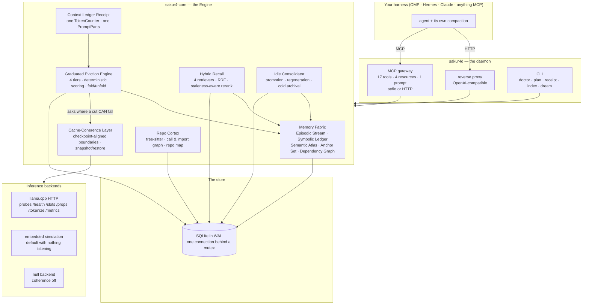

# Architecture

> How the pieces fit: the MCP gateway, the Engine, the Memory Fabric, the store, the Repository
> Cortex, the Cache-Coherence Layer and the Idle Consolidator — plus what actually happens, in order,
> on one turn.

---

**On this page:** [Component map](#component-map) · [How one turn is written](#how-one-turn-is-written) ·
[How recall reads](#how-recall-reads) · [The Idle Consolidator](#the-idle-consolidator) ·
[The Repository Cortex](#the-repository-cortex) · [The storage layer](#the-storage-layer) ·
[What enforces what](#what-enforces-what) · [What is not enforced](#what-is-not-enforced)

---

## Component map

Two crates carry the system. `sakur4-core` is the engine — **no transport, no MCP** — and `sakur4d` is
the daemon: CLI, MCP gateway and reverse proxy. `sakur4-testkit` supplies fixture repositories and a
fake llama.cpp server for tests.



The module boundaries are the project's own, from
[`crates/sakur4-core/README.md`](https://github.com/sc4rfurry/Sakur4/blob/master/crates/sakur4-core/README.md):

| Module | What it does |
|---|---|
| `memory` | The dual-track Memory Fabric: append-only Episodic Stream, deterministic Symbolic Ledger, anchored Semantic Atlas, Anchor Set, Dependency Graph |
| `evict` | The Graduated Eviction Engine: four tiers, dependency-graph-aware scoring, `fold`/`unfold` |
| `cache` | The Cache-Coherence Layer: checkpoint-aligned eviction boundaries, snapshot/restore |
| `llama` | The pluggable backend trait plus llama.cpp, embedded and null implementations |
| `repo` | Repo Cortex: tree-sitter extraction, call/import graph, token-budgeted repo map |
| `recall` | Hybrid retrieval with staleness-aware reranking |
| `consolidate` | The Idle Consolidator: promotion, staleness regeneration, cold archival |
| `provider_cache` | Prompt-cache accounting for hosted providers |
| `receipt` | The Context Ledger Receipt |
| `prompt` | The single prompt assembler every budget decision uses |

**The Engine is the composition point.** `Engine::open` derives the project identity
`proj_<hash(project_root)>`, opens the store, and hands clones of the same handle to every component —
`MemoryFabric::new(db.clone())`, `Coherence::new(db.clone())` and so on — so there is exactly **one**
database connection in the process. That fact matters more than it sounds: a long hunt for a
read-after-write defect spent several rounds on the hypothesis that two components were talking to
different stores. They cannot be.

**The gateway is deliberate about its shape.** `code.*` returns parser output that cannot be wrong the
way a model is wrong; `memory.recall` returns stored memory with every interpretive hit **labelled**;
`context.plan_eviction` defaults to *planning only*, so an agent can see the eviction decision before
taking it. The tool catalog is configuration-independent, so list responses carry a long `ttlMs` with a
private `cacheScope` and the bytes are identical between calls. The system preamble names **when** to
call each tool rather than what it does, because smaller local models under-trigger proactive folding.

---

## How one turn is written

`memory.commit_episode` is FR-1's **only** write path, and the preamble tells the model to commit every
turn. In order:

```text
memory.commit_episode { role, content, tool_name?, session_id?, slot_id? }
  │
  ├─ 1. tokenize the content through the one TokenCounter
  │
  ├─ 2. Db::write — one IMMEDIATE transaction, retried on SQLITE_BUSY
  │      ├─ upsert the session row (session_id, slot_id, created_at)
  │      ├─ seq  = COALESCE(MAX(seq), 0) + 1        (unique across the store)
  │      ├─ INSERT episodic_stream (… eviction_tier = 'live', project_id …)
  │      └─ for each fact from ToolOutputParser:
  │             upsert_symbolic_fact_tx  +  edge episode --derived_from--> fact
  │      └─ COMMIT  — the transaction returns only after tx.commit()
  │
  ├─ 3. outside the transaction: ConstraintDetector::detect → an anchor PROPOSAL
  │      (deliberately outside: a proposal must never be able to fail a commit)
  │
  └─ CommitOutcome { episode_id, seq, token_count, facts_extracted,
                     symbolic_summary, anchor_proposal }

derived state, not written by the handler:
  · FTS5 index row        — by an AFTER INSERT trigger on episodic_stream
  · dependency edges      — inside the transaction, above
  · Semantic Atlas entry  — later, by the Idle Consolidator, and only if it shrinks
```

Three details are load-bearing rather than incidental:

- **The episode row and its symbolic facts share one transaction.** A committed turn either has its
  parser-derived facts or it does not exist; there is no state in which a turn is recorded and its
  deterministic facts are missing.
- **Constraint detection is outside it.** Turning a turn into a proposed anchor is a heuristic, and a
  heuristic that can fail a commit is a memory layer that loses turns.
- **The write completes before it returns.** `Db::write` runs the transaction **on the calling task**
  rather than deferring it to `spawn_blocking`, so the lock is taken, the closure runs and `tx.commit()`
  returns before `write` does. That was changed deliberately during the long hunt for the pipelined
  read-after-write defect — and it **moved that defect without closing it** (see
  [What is not enforced](#what-is-not-enforced)). The cost of the change is that a SQLite write blocks
  the async worker running the handler, which is microseconds for a local store, and the honest trade
  against an acknowledgement that does not mean what it says.

`memory.pin` is the other write of consequence: it appends to the Anchor Set, which is rendered
verbatim and is not an eviction candidate at all.

---

## How recall reads

`memory.recall` runs **four retrievers**, merges them with a weighted reciprocal rank fusion, reranks
deterministically, then labels every hit.

| # | Retriever | Strength | Why it is there |
|---|---|---|---|
| 1 | **FTS5 BM25** over the Episodic Stream | exact identifiers, error strings, file paths | reaches the raw transcript, including evicted turns |
| 2 | **FTS5 BM25** over the Semantic Atlas | summaries, in their own right | added because graph traversal from a stream hit goes *episode → fact* and never reaches an entry derived from it, and dense retrieval only finds entries that were embedded — so summaries were nearly **invisible**, which made staleness untestable in practice |
| 3 | **Cosine** over embeddings | paraphrase, concept-level similarity | covers what lexical search cannot; annotates results as lexical-only when unavailable |
| 4 | **Graph adjacency** | structural relatedness | neighbours in the Dependency Graph, plus every Atlas entry anchored to a matched symbolic fact — which is exactly the entry whose staleness matters most |

**Fusion is weighted reciprocal rank fusion**, `weight / (10 + rank)` summed per candidate — not score
normalisation. BM25, cosine similarity and graph distance are not on comparable scales, and any
normalisation between them would be an arbitrary constant dressed up as a measurement. Defaults:
`bm25_weight` 1.0, `vector_weight` 0.8, `graph_weight` 0.6, 30 candidates per retriever, 8 results.

**Reranking is local, cheap and explainable** — a cross-encoder would blow NFR-2's 300 ms budget on a
CPU-only box. The features are retriever agreement, lexical overlap with the query, recency, whether the
hit is a symbolic fact (ground truth) rather than an interpretation, and a **×0.35 penalty** for
staleness. Each contributes a stated reason, so a ranking can be audited rather than believed.

**Labelling is the part that makes it usable.** Every result carries its `kind`
(`episode` / `symbolic_fact` / `semantic_entry`), its id, its score, which retrievers found it, its
token cost and its reasons. A stale entry comes back with `stale: true` and `current_value` holding the
anchor's **current** content. The tool's own description states the contract: *trust `current_value`,
not `text`*.

One discrepancy worth knowing if you are writing a client: four retrievers run, but the `backends`
field reports **three** names — `bm25`, `vector(<model>)`, `graph` — because the Atlas BM25 retriever
reuses the `bm25` label. A hit's `retrievers` array will therefore say `bm25` for both the transcript
and the Atlas. The count of live retrievers is not the length of `backends`.

Recall is **project-scoped by default** — omitting `project_id` searches the project the daemon was
started for, and passing one is how you deliberately search another. See
[Memory Model](Memory-Model).

---

## The Idle Consolidator

Memory-quality work is moved **off the interactive path** entirely: promotion of high-value episodes
into the Semantic Atlas, staleness detection and regeneration, re-embedding, and archival of long-cold
episodes all happen when no slot is generating. That is the "dream cycle" — `sakur4.dream`, or
`sakur4d dream` from a shell.

Two requirements are handled structurally rather than by policy:

- **It never runs concurrently with an active generation on any tracked slot.** Every tracked slot is
  asked before **each work item**, not on a timer, and a slot that starts generating mid-pass stops the
  pass. A slot whose state **cannot be read counts as busy**, because "cannot prove idle" is not "idle".
- **It is fully interruptible.** Work is performed one item per transaction, and the loop re-checks
  idleness between items, so an interruption loses at most the item in flight — and that item was never
  partially written.

Summaries default to **extractive**: a deterministic selection of the episode's own sentences,
prefixing the identifiers it found. It is not a semantic compression and does not pretend to be — which
is what keeps the dual-track rule intact with **no auxiliary model resident**. A configured auxiliary
endpoint switches it to genuine interpretation, still anchored.

A promotion must **actually shrink the context**. An extractive summary of a short or dense turn can be
longer than the turn, and an Atlas entry costing more tokens than the text it replaces is a regression
dressed up as maintenance; such a promotion is skipped and reported. `min_episode_tokens` (96 by
default) is a proxy for that; the measurement is the check. Other defaults: 90 s quiet period, 15 s
poll, at most 24 items per pass, archive after 14 days.

---

## The Repository Cortex

The structural index, and the feed into the Symbolic Ledger: **every symbol this module extracts
becomes a `SymbolicFact` with an `ast_hash`.** That single decision is what makes three requirements
fall out at once — the Ledger is parser-populated (FR-2), incremental re-indexing is natural-key upsert
so one changed file costs O(symbols in that file) (FR-9), and staleness is a **hash comparison**, so a
summary anchored to a symbol is invalidated the moment the symbol's source changes (FR-12/INN-4).

- tree-sitter grammars for Python, TypeScript/TSX/JavaScript, Rust and Go; a conservative extractor for
  JSON, TOML, YAML, SQL, shell and Markdown that extracts *declared names* without pretending to
  structural understanding; files it cannot parse are indexed as `unsupported` rather than silently
  skipped.
- Qualified names come from the node's **ancestors** (`scope_of`), not from a mutable stack threaded
  through the recursion. The stack version mis-qualified siblings after a missed pop, recording
  `Engine::new` as `new`.
- Cross-file call resolution goes through a short-name index with **same-module preference**.
- The **repo map** is token-budgeted and centrality-ranked, and its monotonicity contract — a smaller
  budget returns a strict *prefix*, not a different ranking — follows from computing the order once
  before applying any budget. `tokens_used` never exceeds `token_budget`; the one exception is a budget
  too small to hold even the header and footer, which returns an explicit "raise the budget" note
  rather than an empty map that looks like an empty repository.

**Nothing re-indexes automatically.** There is no filesystem watcher, so the map dates itself in its own
body, and `sakur4://repo-map/{project}` says when it was built — because a map with no date reads as
current, which is the condition under which a structural answer is most confidently wrong.

---

## The storage layer

**SQLite in WAL.** Readers are independent of the writer, which is what makes the harness-facing
`commit_episode` path non-blocking in practice. There is one connection behind a mutex, and the two
access shapes differ:

| Path | Where it runs | Consequence |
|---|---|---|
| `Db::with` (reads) | `tokio::task::spawn_blocking` | a read does not occupy an async worker |
| `Db::write` (writes) | **the calling task** | `tx.commit()` has returned before `write` returns |

`docs/DESIGN.md`'s storage section still describes the layer as "all work on blocking threads"; the
write path is the exception, and the reason is recorded at the fix site in `db.rs` rather than only in
the design notes.

**Vectors** live in a blob table with an exact cosine scan in Rust, unless a `sqlite-vec` loadable
extension is found — in which case `vec0` serves the ANN path and the store records which backend is
live. Linking the C extension in would fight the single-static-artefact goal, and a *loadable* extension
satisfies both. At the documented scale ceiling an exact scan is a few tens of milliseconds **and is
exact**, so recall quality never depends on which backend is present. `doctor` prints which.

**The backend is probed, never assumed.** `InferenceBackend` has three implementations — the llama.cpp
HTTP adapter, an embedded simulation, and a null backend for "cache coherence is off" — and `resolve()`
picks between them from `auto`/`embedded`/`none`/URL. `auto` probes and falls back to embedded, so a
developer with no server running still gets a fully functional Sakur4 whose cache behaviour is
**observably simulated**: the backend's name appears in the receipt. See
[Cache Coherence](Cache-Coherence) for what is probed and what each answer means.

---

## What enforces what

`docs/DESIGN.md` does **not** describe a named "five layers of enforcement" model — this page will not
invent one. What it describes, in several places, is that specific guarantees hold *structurally*
rather than by convention. Collected, they are:

| Guarantee | Enforced by | Where it is stated |
|---|---|---|
| A model cannot write the Symbolic Ledger | one constructor requiring a `FactSource`; the module graph imports nothing that could reach an inference client | DESIGN.md, *FR-2 is enforced by types and by the module graph* |
| Recorded content cannot be altered | `BEFORE UPDATE`/`BEFORE DELETE` triggers on `episodic_stream`; eviction writes only to `eviction_tier` | `store/schema.rs`; FR-1/FR-5 |
| Anchors cannot be evicted | eviction selects from episodes; anchors live in a different table, so the operation is not expressible | README, *guarantees are structural* |
| Tiers are never skipped | the escalation ladder is control flow, not a check | DESIGN.md, *FR-5's first acceptance criterion expressed as control flow* |
| Budget decisions and printed numbers agree | one `TokenCounter` and one `PromptParts` behind every decision and every printed figure | DESIGN.md, *Token accounting* |
| Library code does not panic | zero `unwrap`/`expect`/`panic!` outside tests; malformed harness input is a typed error | README; `sakur4-core` README |
| Staleness cannot go unnoticed | a live comparison in the `semantic_atlas_staleness` view, so no job has to run for a summary to be stale | `store/schema.rs`; INN-4 |

The design notes are explicit about why this style was chosen: *"a regression test that cannot fail is
worse than none"*, and *"a job that has not run is a lie the system tells itself"*. Twice during
development a component estimated while another measured, and both times the engine decided "relaxed"
while the receipt printed a nearly-full window.

---

## What is not enforced

The same document is unusually direct about the places where a mechanism exists in the shape of the
code but not in its behaviour. These are collected on [Limitations](Limitations); the architectural
ones are:

- **Supersession fires now.** `MemoryFabric::mark_superseded` is called by `memory.commit_episode` when a
  turn names what it corrects, so the eviction engine's −3.0 "superseded by a later episode" adjustment
  reaches a corrected turn and makes it a safe `Drop` candidate. Until this release no code path produced
  the value that rule acts on — the column, the edge kind and the scoring rule all existed and were
  unreachable, and this entry said so.
- **A read can observe the store before a pipelined write in front of it has landed.** In a **pipelined
  batch** — several frames at once, stdin closed — a read is executed in an **arbitrary order** relative
  to the write. `memory.commit_episode` answers with a real `ep_…` identifier while a `sakur4.status` in
  the same batch reports the count from before it. Measured over repeated runs, the permutation is
  neither first-in-first-out nor last-in-first-out, and a different one each time. **Eight fixes have
  been attempted and none of them shipped.** **Sending each call and awaiting its answer is correct**,
  and is what every harness tested here does. The protocol permits the reordering; the tools are
  stateful, which is the mismatch.
- **Three `PromptParts` slots are populated only by tests and the testkit.** `with_repo_map`,
  `with_tool_schemas` and `with_folds` have no production caller — though the notes narrow this
  usefully: `tools.rs::assemble_parts` is a *diagnostic preview* for `context.plan_eviction`, and Sakur4
  never assembles the prompt a model receives (the harness does). What remains genuinely open is
  narrower: the receipt accounts tokens to a `fold summaries` category that is always zero, and
  `RenderedPart::RepoMap` exists as a slot with a budget that nothing connects to
  `code.get_repo_map`.
- **`Db::stats()` ends its scalar closure in `unwrap_or(0)`**, so any query failure becomes a
  plausible-looking zero. `doctor` and `status` cannot distinguish "none" from "could not tell".

---

## Where to go next

| If you want… | Read |
|---|---|
| The tools this architecture exposes, with arguments | [Tool Reference](Tool-Reference) |
| Why the boundary is chosen from the cache first | [Cache Coherence](Cache-Coherence) |
| The Ledger and the Atlas in detail | [Memory Model](Memory-Model) |
| Every open defect, stated plainly | [Limitations](Limitations) |
| What the design costs and saves | [Benchmarks](Benchmarks) |

---

<sub>[← Back to Home](Home) · [All pages](Home#where-to-go-next)</sub>
