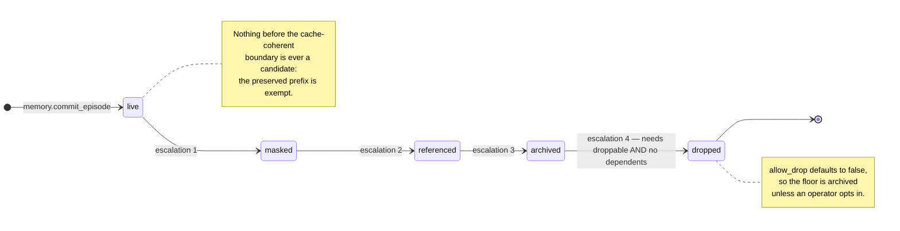

# Concepts

> The vocabulary this project is built out of — the twelve words the rest of the site assumes, each
> with where it lives and which document defines it.

---

**On this page:** [The one-paragraph version](#the-one-paragraph-version) ·
[Glossary](#glossary) · [The two tracks, and why a model may write to only one](#the-two-tracks-and-why-a-model-may-write-to-only-one) ·
[The eviction ladder](#the-eviction-ladder) · [The four eviction verdicts](#the-four-eviction-verdicts) ·
[Two words that are easy to confuse](#two-words-that-are-easy-to-confuse)

---

## The one-paragraph version

A long agent session does not run out of ability, it runs out of **context**. The usual fix —
summarise the transcript and replace it — is lossy, and it is also *expensive*, because the rewritten
prompt no longer shares a prefix with what the inference server has cached, so the whole thing is
prefilled again. Sakur4 splits the problem in two. It keeps an **append-only** record of everything
that happened, so nothing is ever actually lost, and it decides what leaves the live window at a
**boundary the server's cache already holds**, so the surviving prompt head is still a prefix of what
the server can reuse. The memory it keeps is written on **two tracks**: deterministic parsers write
facts, models write interpretations, and every interpretation must name the fact it came from so its
staleness can be checked when it is read.

---

## Glossary

| Term | Plain meaning | Where it lives |
|---|---|---|
| **Episode** | One recorded turn: a role, its content, and optionally the tool that produced it. Append-only, and returned **byte-identically** after eviction. | `episodic_stream` table; `memory.commit_episode` |
| **Symbolic fact** | A fact extracted by a **deterministic parser** — a symbol and its signature, a JSON field, an HTTP header, a diff hunk, an exit code. No model is in this path. | `symbolic_fact` table; `memory/symbolic.rs` |
| **Semantic entry** | A **model-written** summary or interpretation. Must name the fact or episode it was derived from, and carries that anchor's hash as it was when written. | `semantic_atlas` table; `memory/semantic.rs` |
| **Anchor** | The thing an interpretation was derived from. Either a `symbolic_fact` or an `episodic_stream` row, by id, plus a hash captured at write time. | `semantic_atlas.anchor_type` / `anchor_id` / `anchor_hash_at_write` |
| **Anchor Set** | The user's **pinned constraints** — "never force-push to `main`". Rendered verbatim, and structurally exempt from eviction. | `anchor_set` table; `memory.pin`; `sakur4://anchors/{project}` |
| **Eviction tier** | How far a turn has been pushed out of the live window: `live` → `masked` → `referenced` → `archived` → `dropped`. Never skipped. | `episodic_stream.eviction_tier`; `evict.rs` |
| **Fold** | A deliberate, agent-directed pocket of sub-context. Opened with a checkpoint, closed by collapsing its episodes and committing **one** summary episode. The full trace stays retrievable. | `folds` table; `memory.fold` / `memory.unfold` / `memory.recall_fold` |
| **Receipt** | The per-turn **Context Ledger Receipt**: where the token budget went, plus the cache verdict with its arithmetic. Every number in it is *measured*, never estimated. | `receipt.rs`; `context.receipt`; `sakur4d receipt` |
| **Pressure** | How full the live window is: `relaxed`, `compacting`, or `anchor_overflow` (the anchors alone cannot fit — no plan can help). | `Pressure` enum; `context.plan_eviction` |
| **Cache-coherent boundary** | A token position where a cut can fall such that everything **before** it is still a prefix the inference server's KV cache holds — so the next turn is a longest-common-prefix match instead of a full prefill. | `cache/plan.rs`; `BoundaryPlan` |
| **Prefix reuse** | The share of the prompt the server did **not** have to prefill, because the head was byte-identical to what it already had. | `PromptObservation::reuse_ratio`; the receipt |
| **The four verdicts** | How a compaction plan resolved: `aligned`, `snapped`, `partial-reuse`, `full-re-prefill`. See the section below — the names on the wire are not quite these. | `BoundaryPlan::status`; `context.receipt` |

---

## The two tracks, and why a model may write to only one

Most memory systems store what a model *said about* the code. That is fine until the code changes —
at which point the stored interpretation is **confidently wrong** and nothing in the system notices.

Sakur4 refuses to let those two kinds of statement share a home.

The **Symbolic Ledger** holds facts extracted by parsing. `SymbolicFact` has exactly one constructor,
`from_deterministic_source`, and it demands a `FactSource` — a closed enum of deterministic
extractors. There is no general `new`, no `From<&str>`, and no way to obtain a `FactSource` from a
model. The write path imports nothing from `embed`, `llama` or `consolidate`. A model cannot write the
Ledger because there is **no code path** by which it could: the discipline is enforced by the type
system and by the module graph, not by a rule someone remembers to follow.

The **Semantic Atlas** is where interpretation lives, and it is allowed to be wrong — which is exactly
why every row must be **anchored**. `put_semantic` reads the anchor *first*; a missing anchor is an
error, not a row with a null hash. Staleness is then resolved at read time by comparing the anchor's
hash at write time with its hash **now**, so a summary is stale the moment its source changes, with no
background job required to notice. At retrieval time a stale entry comes back labelled
`[STALE SUMMARY — do not trust]` **carrying the anchor's current value**, because the failure mode is
not a missing answer, it is a plausible one. Down-ranking alone would not be enough: the entry's
authority is replaced rather than merely lowered.

**Structured tool output counts as symbolic too.** `ToolOutputParser` handles JSON (parsed, not
scanned), CSV, HTTP headers, unified diffs and exit codes, so a research session gets the same
deterministic anchoring a code-reading session does. Prose has no symbolic anchor, and `parse_any`
returns an empty fact set with `parser: None` and a summary saying "no structure detected" — rather
than guessing at one.

Full detail, including what a reader should do with a `[STALE]` hit, is on
[Memory Model](Memory-Model).

---

## The eviction ladder

Four tiers, applied **one step at a time**, never skipped. That is FR-5's first acceptance criterion
expressed as control flow rather than as a check — there is no code path that could jump rungs.

Read the ladder with three footnotes:

- **`live` is the starting rung, not an eviction tier.** `docs/DESIGN.md` and the CHANGELOG both say
  **four tiers** — `masked`, `referenced`, `archived`, `dropped` — and the column's `CHECK` constraint
  admits `live` alongside them as the value a row is written with. The tier ladder itself is the four
  escalations above it.
- **A step may reclaim nothing.** A `Masked` stub can be *longer* than the very short episode it
  replaces; the ladder no longer refuses such a step, because a later rung does reclaim. The plan's
  reason records it plainly, e.g. `tier live → masked (value 2.65, 0 token(s) reclaimed)`.
- **Anchor Set rows are not on this ladder at all.** Eviction selects from episodes; anchors live in a
  different table. Evicting a pinned constraint is not expressible. If the anchors alone cannot fit,
  the operation **refuses with `BudgetOverflow`** rather than dropping one silently.

Candidate scoring is deterministic and explainable — recency, role, in-degree in the Dependency Graph,
size, supersession, explicit droppability — and **no model is consulted**, so a plan is reproducible
and auditable. Round-trip integrity holds structurally: eviction writes only to `eviction_tier`, and
`UPDATE`/`DELETE` on recorded content is blocked by database triggers.

---

## The four eviction verdicts

Every plan ends in one of four verdicts, and **the fallback is first class**: with no server, an older
build without `/slots`, or a sliding-window model whose checkpoints carry only partial state, the plan
is still produced, still evicts, and says **why** alignment was impossible.

| Verdict | What it means |
|---|---|
| `aligned` | The prefix is preserved exactly at a checkpoint — the cut landed where the server can rewind to. |
| `snapped` | The cut moved **back** onto an older checkpoint, within the snap tolerance (512 tokens by default). |
| `partial-reuse` | Some prefix survives and the rest is prefilled. |
| `full-re-prefill` | Nothing survived. Reported, with the reason attached. |

**The names above are the documented ones, and they are not the values on the wire.** This is worth
stating plainly, because it is exactly the kind of gap that has bitten this project before:

- `README.md` and the generated figure `docs/assets/coherence.svg` present these four as what "every
  plan ends in one of".
- The `cache_status` field that `context.plan_eviction` and `context.receipt` actually emit is
  `CacheStatus::as_str()`, whose values are **`unknown`, `cold`, `full-re-prefill`, `partial-reuse`,
  `warm-restored`**.
- `aligned` and `snapped` are therefore *descriptive* rather than enumerated: `BoundaryPlan::aligned(…)`
  returns `partial-reuse` for both, and whether the cut landed exactly on a checkpoint (Δ0) or was
  snapped back onto an older one is carried in the plan's `reason` text and its structured `snap`
  field — e.g. `snapped 128 tokens back onto an in-memory checkpoint`.

If you are writing code against this, branch on the five `cache_status` strings. If you are reading a
receipt to understand a slow turn, the `reason` is where the four verdicts are distinguished.

---

## Two words that are easy to confuse

**Staleness** is about the **Semantic Atlas**: a summary whose anchor has changed since it was written.
It is computed live, on every read, from a hash comparison, and it is a working mechanism.

**Supersession** is about **episodes**: a later turn replacing an earlier one. The eviction engine's
scoring reads `episode_row.superseded_by` and subtracts 3.0 from a marked episode's value, so a corrected
turn is a safe `Drop` candidate rather than something kept for lack of a reason to let it go.
`MemoryFabric::mark_superseded` writes that column, and it is called when a turn names what it corrects.

The distinction from staleness is worth holding onto: **staleness is computed** from hashes on every
read, and **supersession is declared** by the caller. See [Memory Model](Memory-Model).

---

## Where to go next

| If you want… | Read |
|---|---|
| How the pieces fit together, and what happens on one turn | [Architecture](Architecture) |
| Why compaction breaks a prompt cache, and what a boundary is | [Cache Coherence](Cache-Coherence) |
| The Ledger and the Atlas in detail, and project isolation | [Memory Model](Memory-Model) |
| The measured numbers, and what they do not establish | [Benchmarks](Benchmarks) |
| Every tool, argument and resource | [Tool Reference](Tool-Reference) |

---

[← Back to Home](Home) · [All pages](Home#where-to-go-next)
