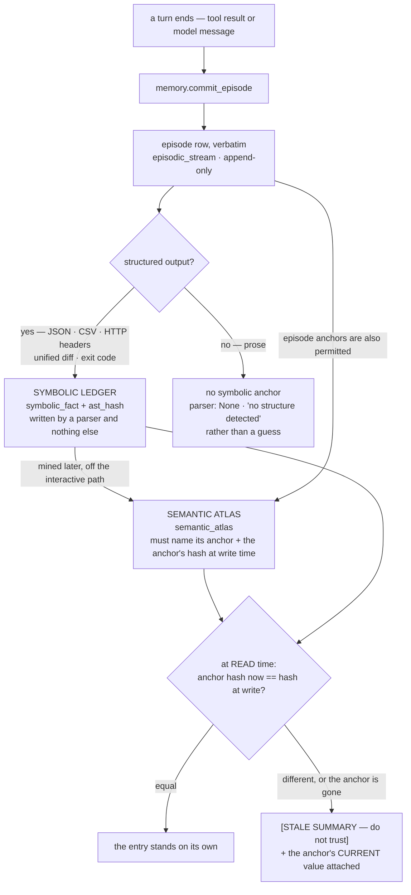

# Memory Model

> The Symbolic Ledger and the Semantic Atlas: what each stores, who is allowed to write it, how a
> summary is caught being wrong, and what "one store, several projects" actually means today.

---

**On this page:** [The two tracks](#the-two-tracks) · [The Symbolic Ledger](#the-symbolic-ledger) ·
[The Semantic Atlas](#the-semantic-atlas) · [Anchoring, and staleness at read time](#anchoring-and-staleness-at-read-time) ·
[What to do with a STALE hit](#what-to-do-with-a-stale-hit) · [Supersession](#supersession) ·
[Project isolation](#project-isolation) · [The Anchor Set](#the-anchor-set) ·
[The natural-key bug that mattered](#the-natural-key-bug-that-mattered) ·
[What is still outstanding](#what-is-still-outstanding)

---

## The two tracks

Most memory systems store what a model *said about* the code. That is fine until the code changes — at
which point the stored interpretation is **confidently wrong**, and nothing in the system detects it.
The classic failure is an agent that "remembers" `checkUser(email)` when the function is now
`validateUser(id)`.

Sakur4 splits the two kinds of statement so they cannot be confused:



| | **Symbolic Ledger** | **Semantic Atlas** |
|---|---|---|
| Holds | facts extracted by parsing | model-written summaries and interpretations |
| Table | `symbolic_fact` | `semantic_atlas` |
| Who may write | a closed set of deterministic extractors, and only those | the Idle Consolidator — extractively by default, or a configured auxiliary model |
| Can a model write it | **no path exists** | yes, that is what it is for |
| Ground truth | yes | no — it must be checkable against ground truth |
| May be wrong | it cannot be wrong the way a model is wrong | yes, which is why it is anchored and dated by hash |
| Staleness | not applicable — `ast_hash` **is** the freshness | computed live against the anchor's current hash |
| Cost of being out of date | none | labelled `[STALE]` at read time and its authority replaced |

---

## The Symbolic Ledger

**One constructor, and it demands a parser.** `SymbolicFact` has exactly one constructor,
`from_deterministic_source`, and it requires a `FactSource` — a closed enum of deterministic extractors.
There is no `From<&str>`, no general `new`, and **no way to obtain a `FactSource` from a model**. The
write path in `memory::symbolic` imports nothing from `embed`, `llama` or `consolidate`. The discipline
is enforced by the type system and the module graph rather than by a rule someone remembers to follow.

**The schema agrees with the types.** `symbolic_fact` has `CHECK (source <> '')` and a constrained
`kind` set covering code symbols (`function`, `method`, `class`, `struct`, `enum`, `trait`, `interface`,
`type`, `constant`, `module`, `import`, `export`) and non-code structure (`tool_output_field`,
`tool_exit_code`, `http_header`, `json_field`, `csv_column`, `diff_hunk`, `regex_match`). As the schema
comment puts it: *"There is deliberately no column an LLM-written value could land in."*

**Two things populate it, and both are parsers:**

- **Repo Cortex**, which turns every symbol it extracts into a `SymbolicFact` with an `ast_hash`. That
  single decision is what makes staleness a hash comparison, and therefore what makes the Atlas
  checkable at all.
- **`ToolOutputParser`**, which handles JSON (**parsed, not scanned**), CSV, HTTP headers, unified diffs
  and exit codes. This is how the dual-track guarantee covers research work rather than only code.
  Pass `tool_name` on a tool result and the extractor uses it to pick the parser, so a diff or a JSON
  body becomes deterministic facts instead of prose.

**Prose has no symbolic anchor, and Sakur4 says so rather than guessing.** `parse_any` returns an empty
fact set with `parser: None` and a summary reading "no structure detected". The design notes are
explicit that this is the wanted behaviour: *"the original plan is explicit that Sakur4 must be honest
about where the guarantee does not apply."*

---

## The Semantic Atlas

**Mandatory anchoring is the whole contract.** Every row carries `anchor_type`, `anchor_id`, and the
anchor's hash **at write time**. `anchor_hash_at_write` is `NOT NULL` in the schema, and the
`anchor_type` `CHECK` admits exactly two values: `symbolic_fact` and `episodic_stream`.

**A missing anchor is an error, not a row with a null hash.** `put_semantic` reads the anchor **first**:
if the thing it is supposed to be a summary of does not exist, the write fails. This is the difference
between a memory that can be audited and one that accumulates assertions about nothing.

**Every entry also carries its project and session**, so an Atlas hit can be scoped the same way an
episode can.

**Interpretation is optional; anchoring is not.** Summaries are produced by the Idle Consolidator and
default to **extractive** — a deterministic selection of the episode's own sentences, prefixing the
identifiers it found. It is not a semantic compression and does not pretend to be, which is what keeps
the dual-track rule intact with **no auxiliary model resident** (the VRAM-headroom question was flagged
open in the original plan, so the default assumes none). A configured auxiliary endpoint switches it to
genuine interpretation, **still anchored**.

**A promotion must actually shrink the context.** An extractive summary of a short or dense turn can be
*longer* than the turn, and an Atlas entry that costs more tokens than the text it replaces is a
regression dressed up as maintenance. Such a promotion is skipped and reported; `min_episode_tokens`
(96) is a proxy for the threshold, and the **measurement** is the check.

---

## Anchoring, and staleness at read time

Staleness is not a flag and not a job. It is a **live comparison** in the
`semantic_atlas_staleness` view:

```sql
-- simplified from store/schema.rs
CASE sa.anchor_type
    WHEN 'symbolic_fact'  THEN (SELECT sf.ast_hash FROM symbolic_fact sf WHERE sf.fact_id  = sa.anchor_id)
    ELSE                       (SELECT printf('%016x', e.seq) FROM episodic_stream e WHERE e.episode_id = sa.anchor_id)
END AS current_anchor_hash
```

An entry is **stale** when `current_anchor_hash != anchor_hash_at_write`, and a **missing** anchor counts
as stale — if the thing an entry was derived from no longer exists, the summary is describing something
that is not there any more, which is exactly the failure this component exists to catch.

The reasoning behind read-time computation is worth quoting, because it rules out the obvious
alternative: *"A boolean `stale` column needs a job to keep it current, and a job that has not run is a
lie the system tells itself."* There is **no window** in which a stale interpretation looks fresh.

Two consequences follow from the hash being what it is:

- A **symbol-anchored** summary goes stale the moment the symbol's source changes — including a signature
  change with no change in behaviour. That is the intended sensitivity.
- An **episode-anchored** summary can effectively never drift, because the anchor's "hash" is the
  episode's `seq` and episodes are append-only and immutable. Such an entry can only become stale by its
  anchor **disappearing**, which the append-only triggers make impossible through normal use. Anchoring
  to a fact is the anchoring that buys you something.

**What a recall does with a stale entry.** Not a down-rank and nothing else. `memory.recall` attaches
the anchor's **current value** and returns `stale: true` with `current_value` populated, applies a
**×0.35** score penalty, and adds the reasons: *"anchor `{}` changed since this summary was written —
summary is not authoritative"*, or *"the anchor no longer exists at all"*. The design notes state the
principle: down-ranking alone would not be enough, because *"the failure mode is a confidently wrong
summary, so the entry's authority is replaced rather than merely lowered."*

---

## What to do with a STALE hit

A stale entry renders in a prompt as:

```text
[STALE SUMMARY — do not trust] <the stored summary>
  ↳ the anchor it was derived from (symbolic_fact:sym_…) has changed since this summary was written;
    re-read the source or call code.query_symbol to get the current truth.
```

In a recall result the short marker is `[STALE]`, the structured field is `stale: true`, and the anchor's
current content is in `current_value`. The tool's own description carries the instruction:

> Any interpretation whose source has since changed is returned with `stale=true` and the source's
> CURRENT value attached — **trust `current_value`, not `text`**.

Three practical rules:

1. **Use the current value.** It is attached precisely so the agent has something **true** to act on
   rather than something plausible to believe.
2. **Do not treat `[STALE]` as corruption.** It is the system working: it means a summary has outlived
   its source. `memory.staleness` lists them (`stale` count plus `stale_rate`); `sakur4d staleness` does
   the same from a shell.
3. **Prefer the parser over the summary when you are unsure.** `code.query_symbol` reads the
   parser-derived index, so it **cannot be stale** — it is the right way to check something you only
   remember from a summary. Regeneration happens off the interactive path: `sakur4d dream` (or
   `sakur4.dream`), which regenerates stale entries rather than leaving them flagged forever.

---

## Supersession

**This is not the same thing as staleness, and the project's own field names make that easy to get
wrong.**

**Staleness** is about the Atlas, is computed live, and works. **Supersession** is about episodes — a
later turn replacing an earlier one — and it **works as of this release**, having been inert before.

Here is the state of it, stated exactly:

- `episodic_stream.superseded_by` exists as a column.
- The eviction engine's scoring **reads** it: an episode with `superseded_by` set has **3.0 subtracted**
  from its value, with the note *"superseded by a later episode"*. The rule is built to drop a stale
  copy **before** its replacement.
- `MemoryFabric::mark_superseded` is the only writer of that column, and it is now called by
  `memory.commit_episode` when a turn names what it corrects. It sets the column, flags the episode
  **droppable**, and writes a `Supersedes` edge.
- `Corrects` and `FoldedFrom` are declared for adjacent purposes and are still never constructed.

So a corrected turn is now **a safe eviction candidate** rather than something the engine keeps for lack
of a reason to let it go. `docs/DESIGN.md` records how it got here: the column, the edge kind, the
scoring rule and the note string all existed for the life of the project with **no way to produce the
value they act on**, because nothing could say "this corrects that".

**The decision that was open is now made, and it is the agent's.** Turning supersession on required
choosing *who* decides an episode is superseded — the agent, a re-read of the same file, or a fold. It is
the caller: a turn passes `corrects` naming the episode it replaces, and an id that matches nothing is an
error rather than a silent no-op.

**One name collision to be aware of.** `memory.recall` returns a field called `stale_flags`, which is
populated from `RecallResult::stale_superseded`. Despite the name it has nothing to do with episode
supersession: it is the list of **Atlas entry ids that were stale** and were therefore presented with
their anchor's current content instead of the summary.

---

## Project isolation

**One store can hold several projects, and one store keeps one project's transcript.**

`Engine::open` derives the project identity from the project root — `proj_<hash(project_root)>` — and
`project_id` is recorded on the tables that need it. The history here matters, because it was a defect
reported from use rather than found by a test:

> **Reported:** working in Oh My Pi in one project surfaced material from another.

The cause was in the store's **shape**: `episodic_stream` was the one table with **no** `project_id`
column — `semantic_atlas`, `symbolic_fact`, `repo_file` and `project` were all keyed by project — and it
is the table the tools write on **every turn**. What that produced, measured against one store with two
project roots:

```text
A commits, with --project-root pointing at A
B asks with --project-root pointing at B
  B sees project_id: proj_cd0ca725b7a54d40   <- a different project, correctly detected
  B recall results: 0                        <- semantic recall IS isolated
  A recall results: 1
```

So the leak was narrower than "everything is shared" — and specific: episodic recall could not be
project-filtered **at all**, because the column did not exist, and the OMP plugin derives `session_id`
as `omp-${basename(cwd)}`, so two checkouts whose directories share a name shared a session id **and**
episodic memory. `sakur4.status` counts were global too.

**The fix, and it is done:**

| Change | Effect |
|---|---|
| `project_id` on `episodic_stream` (migration 3), with an index on `(project_id, seq)` | the transcript can be scoped |
| MCP and CLI commit paths record it | new episodes carry their project |
| Episodic recall filters on it | the gap that only the Atlas retriever honoured the caller's project is closed |
| `memory.recall` takes an optional `project_id` | searching another project deliberately is possible; **omitting it uses the daemon's own project**, which is what keeps one project's transcript out of another's answers |
| `sakur4.status` reports `project_episodes` / `project_facts` / `project_atlas` scoped to the caller, alongside store-wide totals, plus `store_holds_other_projects` | a count that looks low is explained rather than surprising. The store-wide fields remain for `doctor`, which is asking about the store |

Verified end to end: two project roots against one store; A commits, B recalls the same term and finds
**nothing** while A finds its own turn; and the status counts agree.

**Two deliberate non-choices**, both of which matter if you are upgrading:

- **Rows written before migration 3 keep `NULL`** and are **excluded** by a scoped query rather than
  attributed to whoever asks. An old episode's project is not recoverable, and guessing would reproduce
  the defect rather than fix it. A scoped query returns fewer rows than the store holds; that is the
  intended reading.
- **This is a breaking change for anyone relying on the old behaviour.** A recall that used to return
  other projects' turns no longer does. That was the defect; a caller that wants it can pass a
  `project_id`.

**What this is not:** shared memory across a monorepo's packages. Each project root is its own memory, so
a session in a new directory starts with **nothing** rather than someone else's history.

---

## The Anchor Set

The Anchor Set is the user's pinned constraints — *"never force-push to `main`"*, *"migrations are
generated by `scripts/gen.sh`"*. Four things are true of it:

- It is rendered **verbatim**.
- It is **structurally exempt** from eviction: eviction selects from episodes, and anchors live in a
  different table, so evicting one is **not expressible**. This is the cleanest result in the whole
  benchmark: the naive arm planted a constraint at turn 1 and destroyed it at its second compaction,
  while Sakur4's arm survived — a **structural** guarantee rather than a statistical one.
- If the anchors alone cannot fit the budget, `render_anchor_block` returns
  **`Error::BudgetOverflow`** rather than dropping one silently.
- Recall and the eviction plan agree about the budget: anchor tokens are counted before any plan is
  proposed, and `Pressure::AnchorOverflow` is what the engine reports when no plan can help.

**One caveat that has already been fixed, kept because it shows where the guarantee can be true and
useless.** The engine kept anchors out of eviction correctly, and the README's claim that pinned content
is "rendered verbatim into every prompt" was **true of the engine and false of the only place a user can
see it**: the OMP extension's context hook called `memory.recall` and nothing else, so a short rule like
*"never edit anything under `migrations/`"* — which matches almost no query — was absent from most turns.
That was found by running a live model: arm A of the live A/B is the same experiment that would have
produced UNKNOWN in **all three** arms before the fix. The extension now reads anchors from their own
resource every turn. See [Benchmarks](Benchmarks).

---

## The natural-key bug that mattered

SQLite treats `NULL` as **distinct** in a unique index. Facts with no project or no file therefore never
conflicted, so an incremental re-index **inserted duplicates** instead of refreshing rows — and a
summary's anchor kept pointing at the stale one.

The natural key is `(project, qualified name, kind, file)`, and it now folds `NULL` to the empty string
**in both the index and the `ON CONFLICT` target**:

```sql
CREATE UNIQUE INDEX symbolic_fact_identity
    ON symbolic_fact(COALESCE(project_id, ''), qualified_name, kind, COALESCE(file_path, ''));
```

The failure was invisible in the read path — the newest row still answered correctly — and **fatal to
staleness**, because the entry's anchor was pinned to the row nobody was updating any more. The
`COALESCE` is load-bearing, not stylistic.

---

## What is still outstanding

- **Nothing ever marks an episode superseded**, as described above. The column, the edge kinds and the
  scoring rule exist; no code path produces the value they act on.
- **A related staleness mechanism exists elsewhere, with its own gap.** FR-11's caller annotation is
  implemented in schema v4: `dependency_graph_edge` records the hash the **caller** held when a call
  site was first observed, and `code.impact_of_change` compares it with the caller's hash today,
  rendering `[STALE: changed since it last saw this symbol]`. It was previously computed and **shown
  nowhere**, and before that the field was a constant `false`. Two deliberate limits: edges written
  **before migration 4** have no recorded hash and report **not-stale rather than not-checked**, because
  backfilling would assert that every existing call site is current — the claim there is no evidence for
  — and the column is **not refreshed on conflict**, since re-indexing the *target* is no evidence about
  the caller.
- **`Db::stats()` masks failure as zero.** Its scalar closure ends in `unwrap_or(0)`, so a failed query
  reads as a plausible `0`; `doctor` and `status` cannot distinguish "none" from "could not tell".
- **A read can observe the store before a pipelined write in front of it has landed**, which matters
  most for exactly the two tools this page is about: commit, then ask what you remember. Await each
  answer. See [Limitations](Limitations).

---

## Where to go next

| If you want… | Read |
|---|---|
| The tools that write and read these two tracks | [Tool Reference](Tool-Reference) |
| Why staleness is resolved at read time rather than by a job | [Design Decisions](Design-Decisions) |
| The measured recall difference the Atlas buys | [Benchmarks](Benchmarks) |
| Every open defect, stated plainly | [Limitations](Limitations) |

---

<sub>[← Back to Home](Home) · [All pages](Home#where-to-go-next)</sub>
